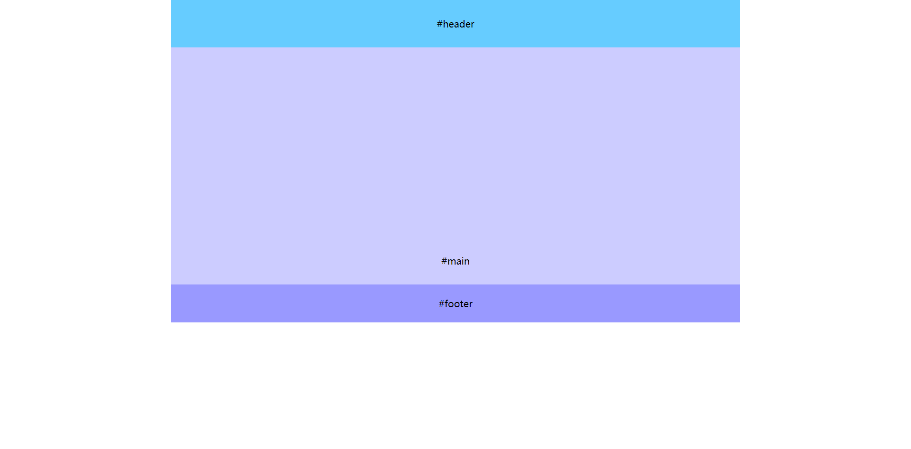
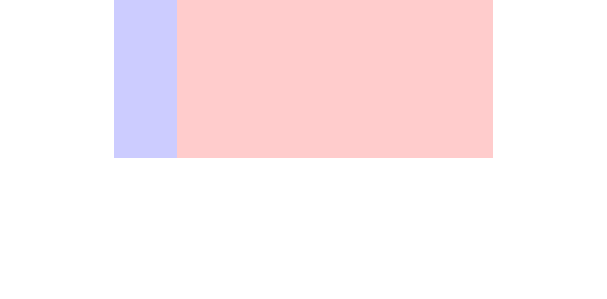
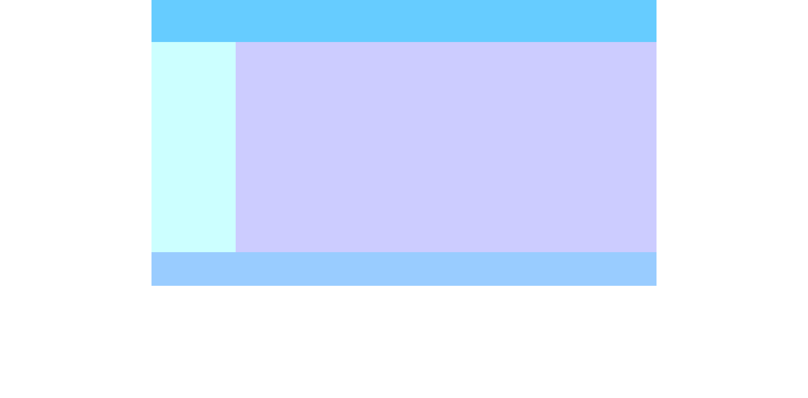
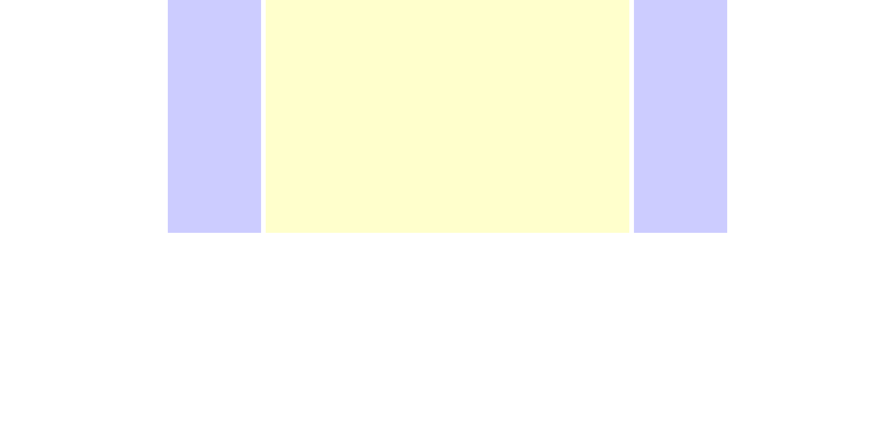
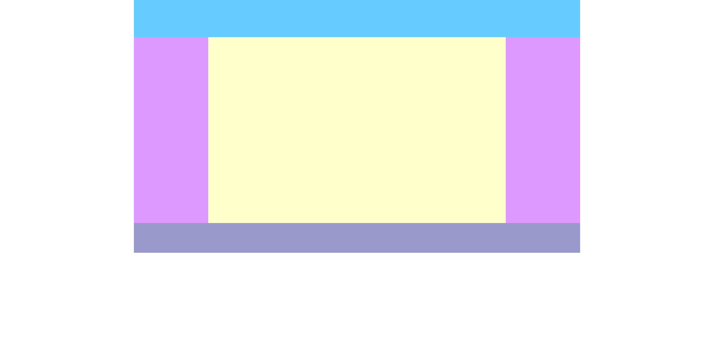

# CSS 经典布局

::: tip 概念
以前的浏览器网页大多数采用的固定宽度布局，固定宽度布局的大小不会随用户调整浏览器窗口大小而变化。一般是 `900px` 到 `1200px`。其中 `960px` 和 `1200px` 是最常见的，因为这两个宽度适合所有现代显示器，而且能被 16、12、10、8、6、5、4 和 3 整除，不仅容易计算等宽分栏的数量，而且计算的结果也可以没有小数。
:::

## 目录

- [上中下一栏式](#上中下一栏式)
- [左右两栏式](#左右两栏式)
- [左右两栏和页眉页脚](#左右两栏和页眉页脚)
- [左中右三栏](#左中右三栏)
- [左中右三栏之双飞翼](#左中右三栏之双飞翼)
- [左中右三栏和页眉页脚](#左中右三栏和页眉页脚)

### 上中下一栏式

#### HTML

```html
<body>
  <header id="header" class="wrap">#header</header>
  <section id="main" class="wrap">#main</section>
  <footer id="footer" class="wrap">#footer</footer>
</body>
```

#### CSS

```css
body {
  margin: 0;
  font-size: 20px;
  text-align: center;
}

.wrap {
  margin: 0 auto; /* 居中 */
  width: 1200px; /* 固定宽度 */
}

#header {
  line-height: 100px;
  height: 100px;
  background-color: #6cf;
}

#main {
  line-height: 900px;
  height: 500px;
  background-color: #ccf;
}

#footer {
  line-height: 80px;
  height: 80px;
  background-color: #99f;
}
```

[在线运行](https://jsfiddle.net/zuoyi615/es62fgur/)




### 左右两栏式

> 三种方式：利用 `margin`、利用 `float`、利用 `absolute`

#### HTML

```html
<body>
  <div class="wrap clearfix">
    <aside id="left"></aside>
    <section id="right"></section>
  </div>
</body>
```

```css
/* 方式一：利用 margin */
body {
  margin: 0;
}

.wrap {
  margin: 0 auto;
  width: 1200px;
  /* width: 80%; width 可以设置百分比 */
}

.clearfix:after {
  /* 清除浮动 */
  content: '';
  display: block;
  clear: both;
}

#left {
  float: left;
  width: 200px;
  height: 500px;
  background-color: #ccf;
}

#right {
  margin-left: 200px; /* 通过 margin 占据 #left 浮动之后的位置，不设置宽度，宽度自动变化 */
  height: 500px;
  background-color: #fcc;
}

/* 方式二：利用 float */
body {
  margin: 0;
}

.clearfix:after {
  content: '';
  display: block;
  clear: both;
}

.wrap {
  margin: 0 auto;
  width: 1200px;
}

#left {
  float: left;
  width: 200px; /* 固定宽度 */
  height: 500px;
  background-color: #ccf;
}

#right {
  float: left;
  width: 1000px; /* 固定宽度 */
  height: 500px;
  background-color: #fcc;
}

/* 方法三：利用 absolute */
body {
  margin: 0;
}

.wrap {
  position: relative;
  margin: 0 auto;
  width: 1200px;
  height: 500px;
}

#left {
  position: absolute;
  top: 0;
  left: 0; /* 右边 */
  width: 200px; /* 固定宽度 */
  height: 500px;
  background-color: #ccf;
}

#right {
  position: absolute;
  top: 0;
  right: 0; /* 右边 */
  width: 1000px; /* 固定宽度 */
  height: 500px;
  background-color: #fcc;
}
```

[在线运行](https://jsfiddle.net/zuoyi615/xg5L0koj/)



### 左右两栏和页眉页脚

#### HTML

```html
<body>
  <header id="header" class="wrap"></header>
  <section id="main" class="wrap">
    <aside id="left"></aside>
    <div id="right"></div>
  </section>
  <footer id="footer" class="wrap"></footer>
</body>
```

#### CSS

```css
body {
  margin: 0;
}

.wrap {
  margin: 0 auto;
  width: 1200px;
}

#header {
  height: 100px;
  background-color: #6cf;
}

#main {
  height: 500px;
  background-color: #ccf;
}

#left {
  float: left;
  width: 200px;
  height: 100%;
  background-color: #cff;
}

#right {
  margin-left: 200px;
  height: 100%;
}

#footer {
  height: 80px;
  background-color: #9cf;
}
```

[在线运行](https://jsfiddle.net/zuoyi615/053tzke1/)



### 左中右三栏

#### HTML

```html
<body>
  <!--
      注意三块的顺序，
      #left 和 #right 浮动，
      不占文档流；如果 #main 放在前面，
      main 会独占一行，#left 或 #right 会换行
  -->
  <div class="wrap clearfix">
    <aside id="left"></aside>
    <aside id="right"></aside>
    <section id="main"></section>
  </div>
</body>
```

#### CSS

```css
body {
  margin: 0;
}

.clearfix:after {
  content: '';
  display: block;
  clear: both;
}

.wrap {
  margin: 0 auto;
  width: 1200px;
  /* width 可以设置百分比 */
}

#left {
  float: left;
  width: 200px;
  height: 500px;
  background-color: #ccf;
}

#right {
  float: right;
  width: 200px;
  height: 500px;
  background-color: #ccf;
}

#main {
  /* #main 不设置宽度，会自动撑开 */
  margin: 0 210px; /* 通过 margin 占位 */
  height: 500px;
  background-color: #ffc;
}
```

[在线运行](https://jsfiddle.net/zuoyi615/f7usroc8/)



### 左中右三栏之双飞翼

#### HTML

```html
<body>
  <!-- 双飞翼布局的三个子元素的顺序 -->
  <div id="wrap" class="clearfix">
    <section id="main">
      <div class="content"></div>
    </section>
    <aside id="left"></aside>
    <aside id="right"></aside>
  </div>
</body>
```

#### CSS

```css
body {
  margin: 0;
}

.clearfix:after {
  content: '';
  display: block;
  clear: both;
}

#wrap {
  margin: 0 auto;
  width: 1200px;
  /* width 可以设置百分比 */
}

#main {
  float: left;
  width: 100%;
  background-color: #ffc;
}

.content {
  height: 500px;
  margin: 0 200px; /* margin 占位 */
}

#left {
  float: left;
  margin-left: -100%; /* 注意这个 margin 是 100%，而且是父级的 100%*/
  width: 200px;
  height: 500px;
  background-color: #ccf;
}

#right {
  float: left;
  margin-left: -200px; /* 注意这个 margin 是 200px */
  width: 200px;
  height: 500px;
  background-color: #ccf;
}
```

[在线运行](https://jsfiddle.net/zuoyi615/y7qecd98/)


### 左中右三栏和页眉页脚

#### HTML

```html
<!-- 整合双飞翼布局 -->
<body>
  <header id="header" class="wrap"></header>
  <section id="main" class="wrap clearfix">
    <div id="middle">
      <div class="content"></div>
    </div>
    <aside id="left"></aside>
    <aside id="right"></aside>
  </section>
  <footer id="footer" class="wrap"></footer>
</body>
```

#### CSS

```css
body {
  margin: 0;
}

.clearfix:after {
  content: '';
  display: block;
  clear: both;
}

.wrap {
  margin: 0 auto;
  width: 1200px;
}

#header {
  height: 100px;
  background-color: #6cf;
}

#main {
  height: 500px;
  background-color: #ffc;
}

#footer {
  height: 80px;
  background-color: #99c;
}

#middle {
  float: left;
  width: 100%;
}

.content {
  height: 500px;
  margin: 0 200px;
}

#left {
  float: left;
  margin-left: -100%;
  width: 200px;
  height: 100%;
  background-color: #d9f;
}

#right {
  float: left;
  margin-left: -200px;
  width: 200px;
  height: 100%;
  background-color: #d9f;
}
```

[在线运行](https://jsfiddle.net/zuoyi615/68157pzr/)



## 源码地址

[CSS 经典布局](https://github.com/ZainYi/classic-layout)
