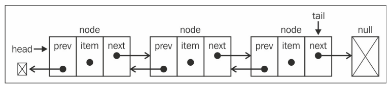
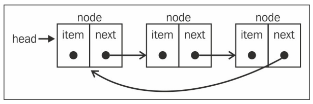
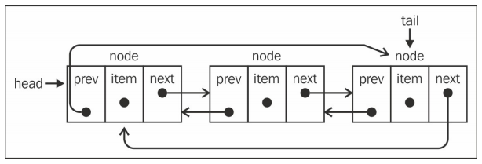

# JavaScript 链表

## 链表

链表：链表存储有序的元素集合，但不同于数组，链表中的元素在内存中并不是连续放置的。链表的每个元素由一个存储元素本身的节点和一个指向下一个元素的引用（也称指针或链接）组成，在添加或移除元素的时候不需要移动其他元素。从数组的起点或中间插入或移除项的成本很高，因为需要移动元素。

**链表的结构**


**链表的特点**

1.  添加或移除元素的时候不需要移动其他元素
1.  链表需要使用指针
1.  要想访问链表中间的一个元素，需要从起点（表头）开始迭代列表直到找到所需的元素

```javascript
// 辅助类，表示要加入列表的项
class Node {
  constructor(element) {
    this.element = element
    this.next = null // 指向下一个节点项的指针
  }
}

class LinkedList {
  constructor() {
    this.length = 0
    this.head = null
  }

  // 向列表尾部添加一个新的项
  append(element) {
    const node = new Node(element)
    let current

    if (this.head === null) {
      this.head = node
    } else {
      current = this.head
      // 从头开始，遍历找到最后一项，最后一项的 next 指针始终是为空的
      while (current.next) {
        current = current.next
      }
      current.next = node // 最后一项的 next 指向新添加的元素上
    }

    this.length++ // 添加之后，更新链表长度
  }

  // 向列表的特定位置插入一个新的项
  insert(position, element) {
    let node = new Node(element)
    let current = this.head
    let previous
    let index = 0

    if (position >= 0 && position <= this.length) {
      // 在边界内的逻辑
      if (position === 0) {
        // 在第一个位置添加
        node.next = this.head
        this.head = node
      } else {
        while (index++ < position) {
          previous = current
          current = current.next
        }

        // 断开该位置的链接，将 Node 与前后链接起来，达到添加目的
        node.next = current
        previous.next = node
      }

      this.length++ // 更新链表长度
      return true
    } else {
      // 在边界外的逻辑
      return false
    }
  }

  // 从列表的特定位置移除一项
  removeAt(position) {
    if (position > -1 && position < this.length) {
      // 在边界内的逻辑

      let current = this.head
      let previous
      let index = 0

      // 移除第一项
      if (position === 0) {
        this.head = current.next
      } else {
        while (index++ < position) {
          previous = current
          current = previous.next
        }

        // 将 previout 的下一项与 current 的下一项链接起来：跳过 current，从而移除它
        previous.next = current.next
      }

      this.length--

      return current.element
    } else {
      return null
    }
  }

  // 从列表中移除一项
  remove(element) {
    const index = this.indexOf(element)
    return this.removeAt(index)
  }

  // 返回元素在列表中的索引。如果列表中没有该元素则返回-1
  indexOf(element) {
    let current = this.head
    let index = -1

    while (current) {
      if (element === current.element) {
        return index
      }
      index++
      current = current.next
    }

    return -1
  }

  // 如果链表中不包含任何元素，返回true，如果链表长度大于0则返回false
  isEmpty() {
    return this.length === 0
  }

  // 返回链表包含的元素个数
  size() {
    return this.length
  }

  // 获取头部元素
  getHead() {
    return this.head
  }

  // 字符化
  toString() {
    let current = this.head
    let string = ''

    while (current) {
      string += current.element + (current.next ? 'n' : '')
      current = current.next
    }

    return string
  }
}
```

## 双向链表

在双向链表中，链接是双向的：一个链向下一个元素，另一个链向前一个元素



```javascript
// 辅助类，表示要加入列表的项
class Node {
  constructor(element) {
    this.element = element
    this.next = null // 指向下一个节点项的指针
    this.prev = null // 指向前一个节点项的指针
  }
}

class DoublyLinkedList {
  constructor() {
    this.length = 0
    this.head = 0 // 头部
    this.tail = 0 // 尾部
  }

  // 指定位置插入一个元素
  insert(position, element) {
    if (position >= 0 && position <= this.length) {
      let node = new Node(element)
      let current = this.head
      let previous = null
      let index = 0

      if (position === 0) {
        if (!this.head) {
          this.head = node
          this.tail = node
        } else {
          node.next = current
          current.prev = node
          this.head = node
        }
      } else if (position === this.length) {
        current = this.tail
        current.next = node
        node.prev = current
        this.tail = node
      } else {
        while (index++ < position) {
          previous = current
          current = current.next
        }

        node.next = current
        previous.next = node

        current.prev = node
        node.prev = previous
      }

      this.length++
      return true
    } else {
      return false
    }
  }

  // 移除指定位置的元素
  removeAt(position) {
    if (position > -1 && position < this.length) {
      let current = this.head
      let previous
      let index = 0

      if (position === 0) {
        this.head = current.next
        if (this.length === 1) {
          this.tail = null
        } else {
          this.head.prev = null
        }
      } else if (position === this.length - 1) {
        current = this.tail
        this.tail = current.prev
        this.tail.next = null
      } else {
        while (index++ < position) {
          previous = current
          current = current.next
        }

        previous.next = current.next
        current.next.prev = previous
      }

      this.length--
      return current.element
    } else {
      return null
    }
  }
}
```

## 循环链表

循环链表可以像链表一样只有单向引用，也可以像双向链表一样有双向引用。循环链表和链表之间唯一的区别在于，最后一个元素指向下一个元素的指针不是引用 null，而是指向第一个元素



## 双向循环链表

双向循环链表有指向 head 元素的 tail.next，和指向 tail 元素的 head.prev


