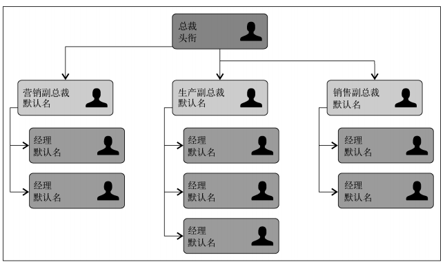
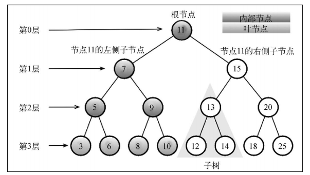
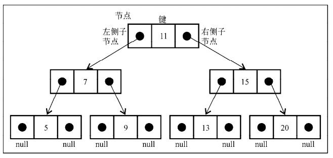
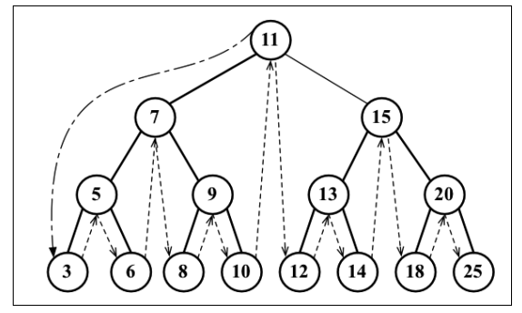
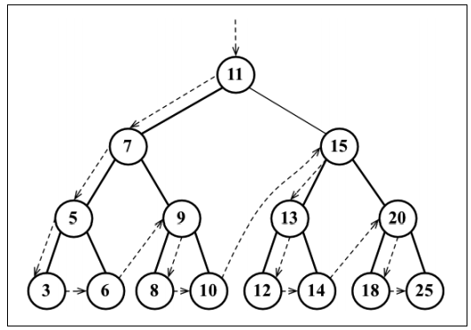
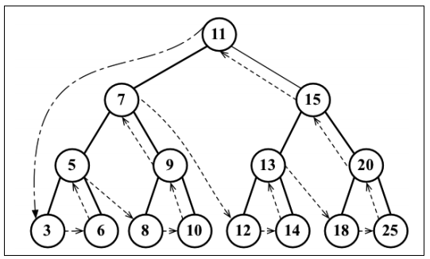
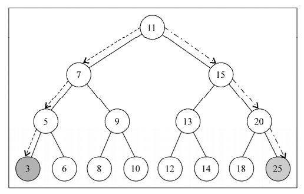

# JavaScript 树

树是一种分层数据的抽象模型



## 树的相关术语



- 根节点：位于树顶部的节点
- 节点：树中的每个元素都叫作节点。节点分为内部节点和外部节点
- 叶节点：没有子元素的节点（也称为外部节点）
- 子树：由节点和它的后代构成
- 节点深度：节点的深度取决于它的祖先节点的数量
- 树的高度：取决于所有节点深度的最大值
- 键：键是树相关的术语中对节点的称呼

## 二叉树

二叉树中的节点最多只能有两个子节点：一个是左侧子节点，另一个是右侧子节点

二叉搜索树（BST）是二叉树的一种，但是它只允许你在左侧节点存储（比父节点）小的值，在右侧节点存储（比父节点）大（或者等于）的值

```javascript
// 辅助类
class Node {
  constructor(key) {
    this.key = key
    this.left = null
    this.right = null
  }
}

class BinarySearchTree {
  constructor() {
    this.root = null
  }

  // 向树中插入一个新的键
  insert(key) {
    const node = new Node(key)

    if (this.root === null) {
      this.root = node
    } else {
      BinarySearchTree.insertNode(this.root, node)
    }
  }

  // 在树中查找一个键，如果节点存在，则返回true；如果不存在，则返回false
  search(key) {
    return BinarySearchTree.searchNode(this.root, key)
  }

  // 通过中序遍历方式遍历所有节点
  inOrderTraverse(callback) {
    BinarySearchTree.inOrderTraverseNode(this.root, callback)
  }

  // 通过先序遍历方式遍历所有节点
  preOrderTraverse(callback) {
    BinarySearchTree.preOrderTraverseNode(this.root, callback)
  }

  // 通过后序遍历方式遍历所有节点
  postOrderTraverse(callback) {
    BinarySearchTree.postOrderTraverseNode(this.root, callback)
  }

  // 返回树中最小的值/键
  min() {
    return BinarySearchTree.minNode(this.root)
  }

  // 返回树中最大的值/键
  max() {
    return BinarySearchTree.maxNode(this.root)
  }

  // 从树中移除某个键
  remove(key) {
    this.root = BinarySearchTree.removeNode(this.root, key)
  }

  // 正确插入 node 的辅助函数
  static insertNode(node, newNode) {
    if (newNode.key < node.key) {
      if (node.left === null) {
        node.left = newNode
      } else {
        BinarySearchTree.insertNode(node.left, newNode)
      }
    } else {
      if (node.right === null) {
        node.right = newNode
      } else {
        BinarySearchTree.insertNode(node.right, newNode)
      }
    }
  }

  // 中序遍历的辅助函数
  static inOrderTraverseNode(node, callback) {
    if (node !== null) {
      BinarySearchTree.inOrderTraverseNode(node.left, callback)
      callback(node.key)
      BinarySearchTree.inOrderTraverseNode(node.right, callback)
    }
  }

  // 先序遍历的辅助函数
  static preOrderTraverseNode(node, callback) {
    if (node !== null) {
      callback(node.key)
      BinarySearchTree.preOrderTraverseNode(node.left, callback)
      BinarySearchTree.preOrderTraverseNode(node.right, callback)
    }
  }

  // 后序遍历的辅助函数
  static postOrderTraverseNode(node, callback) {
    if (node !== null) {
      BinarySearchTree.postOrderTraverseNode(node.left, callback)
      BinarySearchTree.postOrderTraverseNode(node.right, callback)
      callback(node.key)
    }
  }

  // 查找最小值的辅助函数
  static minNode(node) {
    if (node) {
      while (node && node.left !== null) {
        node = node.left
      }
      return node.key
    }
    return null
  }

  // 查找最大值的辅助函数
  static maxNode(node) {
    if (node) {
      while (node && node.right !== null) {
        node = node.right
      }
      return node.key
    }
    return null
  }

  // 在树中查找一个键的辅助函数
  static searchNode(node, key) {
    if (node === null) {
      return false
    }

    if (key < node.key) {
      return BinarySearchTree.searchNode(node.left, key)
    } else if (key > node.key) {
      return BinarySearchTree.searchNode(node.right, key)
    } else {
      return true
    }
  }

  // 移除键的辅助函数
  static removeNode(node, key) {
    if (node === null) {
      return null
    }

    if (key < node.key) {
      node.left = BinarySearchTree.removeNode(node.left, key)
      return node
    } else if (key > node.key) {
      node.left = BinarySearchTree.removeNode(node.right, key)
      return node
    } else {
      // 只有一个节点
      if (node.left === null && node.right === null) {
        node = null
        return node
      }

      // 一个只有一个子节点的节点
      if (node.left === null) {
        node = node.right
        return node
      } else if (node.right === null) {
        node = node.left
        return node
      }

      // 一个有两个节点的节点
      const aux = BinarySearchTree.findMinNode(node.right)
      node.key = aux.key
      node.right = BinarySearchTree.removeNode(node.right, aux.key)
      return node
    }
  }

  static findMinNode(node) {
    while (node && node.left !== null) {
      node = node.left
    }
    return node
  }
}

const tree = new BinarySearchTree()
tree.insert(11)
tree.insert(7)
tree.insert(15)
tree.insert(5)
tree.insert(3)
tree.insert(9)
tree.insert(8)
tree.insert(10)
tree.insert(13)
tree.insert(12)
tree.insert(14)
tree.insert(20)
tree.insert(18)
tree.insert(25)
tree.insert(6)

tree.inOrderTraverse(value => {
  console.log(value)
})

tree.preOrderTraverse(value => {
  console.log(value)
})

tree.postOrderTraverse(value => {
  console.log(value)
})

tree.min()

tree.max()
```



### 中序遍历



### 先序遍历



### 后序遍历



### 树的最小/大值



## 自平衡树

Adelson-Velskii-Landi 树，任何一个节点左右两侧子树的高度之差最多为 1。也就是说这种树会在添加或移除节点时尽量试着成为一棵完全树

自平衡树暂不作讨论
