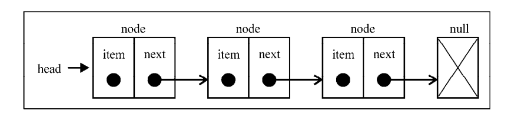

# JavaScript 模拟链表

链表：链表存储有序的元素集合，但不同于数组，链表中的元素在内存中并不是连续放置的。链表的每个元素由一个存储元素本身的节点和一个指向下一个元素的引用（也称指针或链接）组成，在添加或移除元素的时候不需要移动其他元素。从数组的起点或中间插入或移除项的成本很高，因为需要移动元素。

**链表的结构**

**链表的特点**

1.  添加或移除元素的时候不需要移动其他元素
1.  链表需要使用指针
1.  要想访问链表中间的一个元素，需要从起点（表头）开始迭代列表直到找到所需的元素
