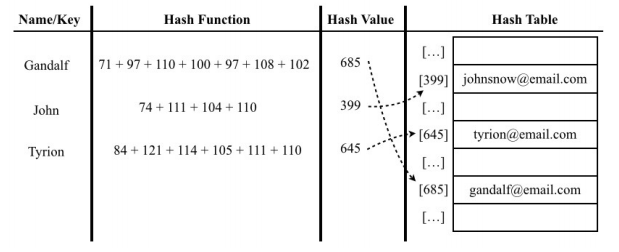

# JavaScript 字典和散列值

集合、字典和散列表可以存储不重复的值。在集合中，我们感兴趣的是每个值本身 **[值, 值]**，并把它当作主要元素。在字典中，我们用 **[键, 值]** 的形式来存储数据。在散列表中也是一样

## 字典

集合表示一组互不相同的元素（不重复的元素）。在字典中，存储的是 **[键, 值]** 对，其中键名是用来查询特定元素的。字典和集合很相似，集合以 **[值, 值]** 的形式存储元素，字典则是以 **[键, 值]** 的形式来存储元素。字典也称作映射

```javascript
class Dictionary {
  constructor() {
    this.items = {}
  }

  // 向字典中添加新元素
  set(key, value) {
    this.items[key] = value
  }

  // 通过使用键值来从字典中移除键值对应的数据值
  delete(key) {
    if (this.has(key)) {
      delete this.items[key]
      return true
    }

    return false
  }

  // 如果某个键值存在于这个字典中，则返回true，反之则返回false
  has(key) {
    return this.items.hasOwnProperty(key)
  }

  // 通过键值查找特定的数值并返回
  get(key) {
    return this.has(key) ? this.items[key] : undefined
  }

  // 将这个字典中的所有元素全部删除
  clear() {}

  // 返回字典所包含元素的数量
  size() {}

  // 将字典所包含的所有键名以数组形式返回
  keys() {
    return Object.keys(items)
  }

  // 将字典所包含的所有的值以数组形式返回
  values() {
    var values = []
    for (var k in items) {
      if (this.has(k)) {
        values.push(items[k])
      }
    }

    return values
  }

  getItems() {
    return this.items
  }
}
```

::: warning 注意
ES6 已经定义了 Map 类
:::

## 散列值

散列算法的作用是尽可能快地在数据结构中找到一个值，哈希表将每个键值中的每个字母的 ASCII 值相加



```javascript
class HashTable {
  constructor() {
    this.table = []
  }

  // 向散列表增加一个新的项（也能更新散列表）
  put(key, value) {
    let position = HashTable.djb2HashCode(key)
    console.log(position + ' - ' + key)
    this.table[position] = value
  }

  // 根据键值从散列表中移除值
  remove(key) {
    let position = HashTable.djb2HashCode(key)
    this.table[position] = undefined
  }

  // 返回根据键值检索到的特定的值
  get(key) {
    let position = HashTable.djb2HashCode(key)
    return this.table[position]
  }

  // lose lose 散列函数
  static loseloseHashCode(key) {
    let hash = 0

    for (let i = 0; i < key.length; ++i) {
      hash += key.charCodeAt(i)
    }

    // 为了得到比较小的数值，使用 hash 值和一个任意数做除法的余数
    return hash % 37
  }

  // 这并不是最好的散列函数，但最受社区推崇的散列函数之一
  static djb2HashCode(key) {
    let hash = 5381

    for (let i = 0; i < key.length; ++i) {
      hash = hash * 33 + key.charCodeAt(i)
    }

    // 将使用相加的和与另一个随机质数（比我们认为的散列表的大小要大）相除的余数。
    return hash % 1013
  }
}

const hash = new HashTable()
hash.put('Gandalf', 'gandalf@email.com')
hash.put('John', 'johnsnow@email.com')
hash.put('Tyrion', 'tyrion@email.com')
```

::: warning 注意
ES6 已经定义的 Map 类，也可以用于散列值
:::
