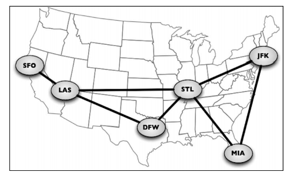
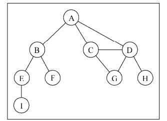
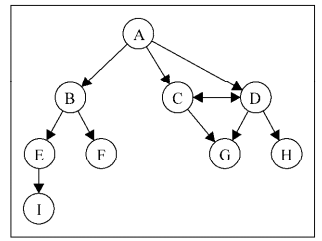
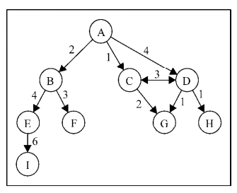

# JavaScript 图

## 图

图是网络结构的抽象模型。图是一组由边连接的节点（或顶点）。学习图是重要的，因为任何二元关系都可以用图来表示

公式：`G = (V, E)`

- V: 一组定点
- E: 一组边，链接 V 中的定点

- 由一条边连接在一起的顶点称为相邻顶点
- 一个顶点的度是其相邻顶点的数量。比如，A 和其他三个顶点相连接，因此，A 的度为 3；E 和其他两个顶点相连，因此，E 的度为 2。
- 路径是顶点 v1, v2,…,vk 的一个连续序列，其中 vi 和 vi+1 是相邻的
- 简单路径要求不包含重复的顶点
- 环也是一个简单路径，比如 A D C A
- 如果图中不存在环，则称该图是无环的。如果图中每两个顶点间都存在路径，则该图是连通的
- 图可以是无向的（边没有方向）或是有向的

- 如果图中每两个顶点间在双向上都存在路径，则该图是强连通的。例如，C 和 D 是强连通的，而 A 和 B 不是强连通的
- 图还可以是未加权的（目前为止我们看到的图都是未加权的）或是加权的

