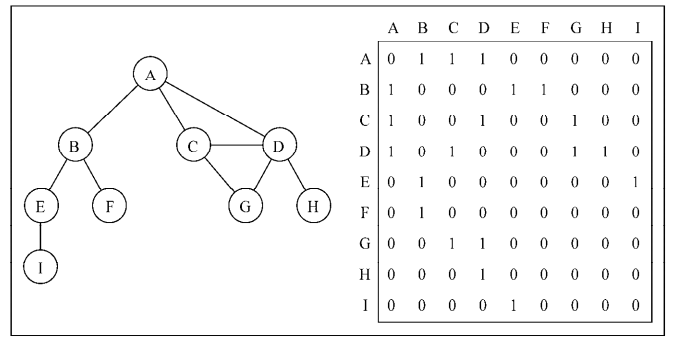
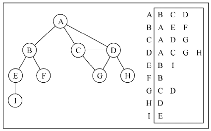
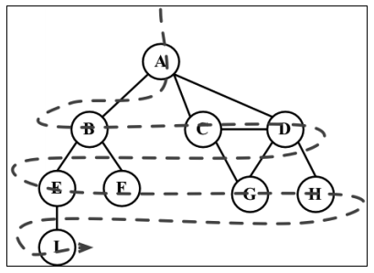
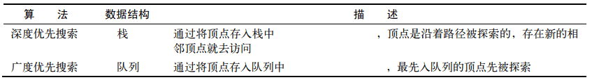

# JavaScript 图

## 图

图是网络结构的抽象模型。图是一组由边连接的节点（或顶点）。学习图是重要的，因为任何二元关系都可以用图来表示


公式：`G = (V, E)`

- V: 一组定点
- E: 一组边，链接 V 中的定点


- 由一条边连接在一起的顶点称为相邻顶点
- 一个顶点的度是其相邻顶点的数量。比如，A 和其他三个顶点相连接，因此，A 的度为 3；E 和其他两个顶点相连，因此，E 的度为 2。
- 路径是顶点 v1, v2,…,vk 的一个连续序列，其中 vi 和 vi+1 是相邻的
- 简单路径要求不包含重复的顶点
- 环也是一个简单路径，比如 A D C A
- 如果图中不存在环，则称该图是无环的。如果图中每两个顶点间都存在路径，则该图是连通的
- 图可以是无向的（边没有方向）或是有向的


- 如果图中每两个顶点间在双向上都存在路径，则该图是强连通的。例如，C 和 D 是强连通的，而 A 和 B 不是强连通的
- 图还可以是未加权的（目前为止我们看到的图都是未加权的）或是加权的


## 图的表示

**邻接矩阵**



**邻接表**



- 邻接表可能对大多数问题来说都是更好的选择
- 邻接表由图中每个顶点的相邻顶点列表所组成

**关联矩阵**



- 在关联矩阵中，矩阵的行表示顶点，列表示边
- 关联矩阵通常用于边的数量比顶点多的情况下，以节省空间和内存

```javascript
// 图的邻接表表示法
class Graph {
  constructor() {
    this.vertices = [] // 存所有顶点的名字
    this.adjList = new Map() // 存邻接表，顶点名为键，邻接顶点列表为值
  }

  // 添加顶点
  addVertex(v) {
    this.vertices.push(v)
    this.adjList.set(v, [])
  }

  // 添加边，接受两个顶点作为参数
  addEdge(v, w) {
    this.adjList.get(v).push(w) // 如果只有这行，会实现一个有向图
    this.adjList.get(w).push(v)
  }

  // 打印邻接表
  toString() {
    let s = ''

    this.vertices.forEach(vertex => {
      s += `${vertex} -> `
      const neighbors = this.adjList.get(vertex)
      neighbors.forEach(neighbor => {
        s += `${neighbor} `
      })
      s += '\n'
    })

    return s
  }
}

const graph = new Graph()
const vertices = ['A', 'B', 'C', 'D', 'E', 'F', 'G', 'H', 'I']
vertices.forEach(vertex => graph.addVertex(vertex))

graph.addEdge('A', 'B')
graph.addEdge('A', 'C')
graph.addEdge('A', 'D')
graph.addEdge('C', 'D')
graph.addEdge('C', 'G')
graph.addEdge('D', 'G')
graph.addEdge('D', 'H')
graph.addEdge('B', 'E')
graph.addEdge('B', 'F')
graph.addEdge('E', 'I')
```

## 图的遍历

图遍历可以用来寻找特定的顶点或寻找两个顶点之间的路径，检查图是否连通，检查图是否含有环等

- 广度优先搜索

- 深度优先搜索

图遍历算法的思想是必须追踪每个第一次访问的节点，并且追踪有哪些节点还没有被完全探索。对于两种图遍历算法，都需要明确指出第一个被访问的顶点

完全探索一个顶点要求我们查看该顶点的每一条边。对于每一条边所连接的没有被访问过的顶点，将其标注为被发现的，并将其加进待访问顶点列表中

为了保证算法的效率，务必访问每个顶点至多两次。连通图中每条边和顶点都会被访问到

广度优先搜索算法和深度优先搜索算法基本上是相同的，只有一点不同，那就是待访问顶点列表的数据结构



这两种方法的具体实现暂不讨论
