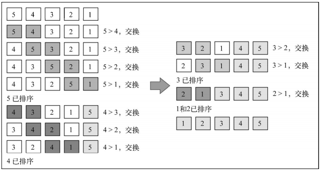
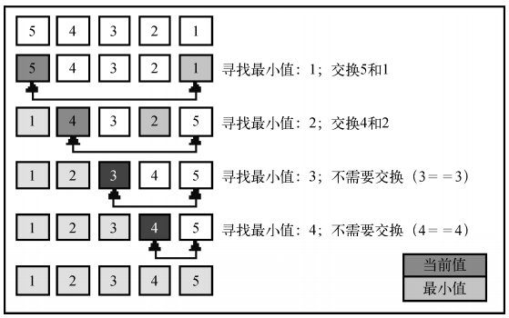
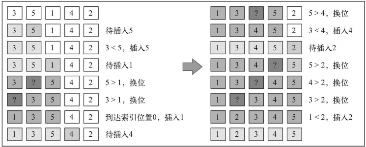
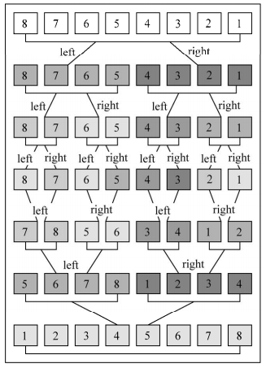

# JavaScript 排序

## 冒泡排序

- 冒泡排序比较任何两个相邻的项，如果第一个比第二个大，则交换它们
- 元素项向上移动至正确的顺序，就好像气泡升至表面一样，冒泡排序因此得名
- 在所有排序算法中最简单，从运行时间的角度来看，冒泡排序是最差的一个
- 复杂度：`O(n^2)`

```javascript
function bubbleSort(arr) {
  const len = arr.length

  // 第一次循环控制排序轮数
  for (let i = 0; i < len; ++i) {
    // 第二层控制比较次数
    for (let j = 0; j < len - 1; ++j) {
      // 判断前一个数是否大于后一个数
      if (arr[j] > arr[j + 1]) {
        // 结构法交换位置
        ;[arr[j], arr[j + 1]] = [arr[j + 1], arr[j]]
      }
    }
  }
}

const arr = [5, 4, 3, 2, 1]
bubbleSort(arr)
```

冒泡排序的工作过程


注意当算法执行外循环的第二轮的时候，数字已经是正确排序的了,尽管如此，在后续比较中，它们还一直在进行着比较。改进一下冒泡排序

```javascript
function bubbleSort(arr) {
  const len = arr.length
  for (let i = 0; i < len; ++i) {
    for (let j = 0; j < len - 1 - i; ++j) {
      if (arr[j] > arr[j + 1]) {
        ;[arr[j], arr[j + 1]] = [arr[j + 1], arr[j]]
      }
    }
  }
}

const arr = [5, 4, 3, 2, 1]
bubbleSort(arr)
```

从内循环减去外循环中已跑过的轮数，就可以避免内循环中所有不必要的比较



## 选择排序

- 选择排序算法是一种原址比较排序算法
- 选择排序大致的思路是找到数据结构中的最小值并将其放置在第一位，接着找到第二小的值并将其放在第二位，以此类推
- 复杂度：`O(n^2)`

```javascript
function selectionSort(arr) {
  const len = arr.length
  let indexMin

  // 第一层循环控制迭代次数
  for (let i = 0; i < len - 1; ++i) {
    // 假设最小的项就是当前迭代轮数的第一个值
    indexMin = i
    for (let j = i; j < len; ++j) {
      if (arr[indexMin] > arr[j]) {
        indexMin = j // 找到当前轮数的最小值
      }
    }

    // 该最小值与原最小值不同，则交换值
    if (i !== indexMin) {
      ;[arr[i], arr[indexMin]] = [arr[indexMin], arr[i]]
    }
  }
}

const arr = [5, 4, 3, 2, 1]
selectionSort(arr)
```

选择排序的工作过程



## 插入排序

- 插入排序每次排一个数组项，以此方式构建最后的排序数组
- 假定第一项已经排序了，接着，它和第二项进行比较，第二项是应该待在原位还是插到第一项之前呢？
- 这样，头两项就已正确排序，接着和第三项比较（它是该插入到第一、第二还是第三的位置呢？），以此类推。
- 排序小型数组时，此算法比选择排序和冒泡排序性能要好

```javascript
function insertionSort(arr) {
  const len = arr.length
  let j
  let temp

  // 算法是从第二个位置
  for (let i = 1; i < len; ++i) {
    j = i
    temp = arr[i]
    while (j > 0 && arr[j - 1] > temp) {
      arr[j] = arr[j - 1]
      j--
    }
    arr[j] = temp
  }
}

const arr = [3, 5, 1, 4, 2]
insertionSort(arr)
```

插入排序的工作过程



## 归并排序

- 归并排序是一种分治算法
- 其思想是将原始数组切分成较小的数组，直到每个小数组只有一个位置，接着将小数组归并成较大的数组，直到最后只有一个排序完毕的大数组
- 归并排序是第一个可以被实际使用的排序算法。前三个排序算法性能不好，但归并排序性能不错
- 复杂度为：`O(n log n)`

```javascript
function mergeSortRec(arr) {
  const len = arr.length

  if (len === 1) {
    return arr
  }

  const mid = Math.floor(len / 2)
  const left = arr.slice(0, mid)
  const right = arr.slice(mid, len)

  // 递归
  return merge(mergeSortRec(left), mergeSortRec(right))
}

function merge(leftArr, rightArr) {
  const result = []
  let i = 0
  let j = 0

  const lenLeft = leftArr.length
  const lenRight = rightArr.length

  while (i < lenLeft && j < lenRight) {
    if (leftArr[i] < rightArr[j]) {
      result.push(leftArr[i++])
    } else {
      result.push(rightArr[j++])
    }
  }

  while (i < lenLeft) {
    result.push(leftArr[i++])
  }

  while (j < lenRight) {
    result.push(rightArr[j++])
  }

  return result
}

const arr = [8, 7, 6, 5, 4, 3, 2, 1]
const result = mergeSortRec(arr)
```

归并排序的工作过程



::: warning 注意
归并排序的过程并不是很好理解
:::

## 快速排序

- 快速排序也许是最常用的排序算法
- 的复杂度为：`O(n log n)`
- 它的性能通常比其他的复杂度为 `O(n log n)` 的排序算法要好
- 和归并排序一样，快速排序也使用分治的方法，将原始数组分为较小的数组

**快速排序的复杂过程**

- 首先，从数组中选择中间一项作为主元
- 创建两个指针，左边一个指向数组第一个项，右边一个指向数组最后一个项。移动左指针直到我们找到一个比主元大的元素，接着，移动右指针直到找到一个比主元小的元素，然后交换它们，重复这个过程，直到左指针超过了右指针。这个过程将使得比主元小的值都排在主元之前，而比主元大的值都排在主元之后。这一步叫作划分操作
- 接着，算法对划分后的小数组（较主元小的值组成的子数组，以及较主元大的值组成的子数组）重复之前的两个步骤，直至数组已完全排序

```javascript
function quickSort(arr) {
  quick(arr, 0, arr.length - 1)
}

function quick(arr, left, right) {
  let index

  if (arr.length > 1) {
    index = partition(arr, left, right)

    if (left < index - 1) {
      quick(arr, left, index - 1)
    }

    if (index < right) {
      quick(arr, index, right)
    }
  }
}

function partition(arr, left, right) {
  const pivot = arr[Math.floor((left + right) / 2)]
  let i = left
  let j = right

  while (i <= j) {
    while (arr[i] < pivot) {
      i++
    }

    while (arr[j] > pivot) {
      j--
    }

    if (i <= j) {
      ;[arr[i], arr[j]] = [arr[j], arr[i]]
      i++
      j--
    }
  }

  return i
}

const arr = [3, 5, 1, 6, 4, 7, 2]

quickSort(arr)
```

## 堆排序

堆排序也是一种很高效的算法，因其把数组当作二叉树来排序而得名。这个算法会根据以下信息，把数组当作二叉树来管理

- 索引 0 是树的根节点
- 除根节点外，任意节点 N 的父节点是 N/2
- 节点 L 的左子节点是 2\*L
- 节点 R 的右子节点是 2\*R+1

可以将数组 `[3, 5, 1, 6, 4, 7, 2]` 想象成下面的树


```javascript
function heapSort(arr) {
  let heapSize = arr.length
  buildHeap(arr)

  while (heapSize > 1) {
    heapSize--
    ;[arr[0], arr[heapSize]] = [arr[heapSize], arr[0]]
    heapify(arr, heapSize, 0)
  }
}

function buildHeap(arr) {
  const heapSize = arr.length
  for (let i = Math.floor(arr.length / 2); i >= 0; i--) {
    heapify(arr, heapSize, i)
  }
}

function heapify(arr, heapSize, i) {
  const left = i * 2 + 1
  const right = i * 2 + 2
  let largest = i
  if (left < heapSize && arr[left] > arr[largest]) {
    largest = left
  }
  if (right < heapSize && arr[right] > arr[largest]) {
    largest = right
  }
  if (largest !== i) {
    ;[arr[i], arr[largest]] = [arr[largest], arr[i]]
    heapify(arr, heapSize, largest)
  }
}

const arr = [3, 5, 1, 6, 4, 7, 2]

heapSort(arr)
```

::: danger 总结
归并排序、快速排序、堆排序理解得不透彻，需要再找资料来加深理解
:::
