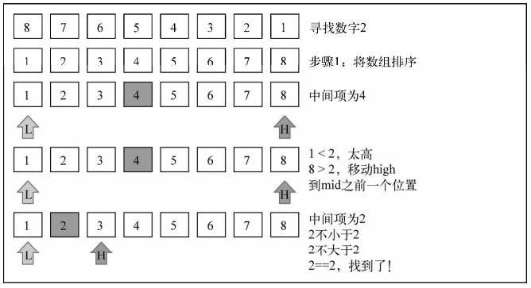

# JavaScript 搜索

## 顺序搜索

顺序或线性搜索是最基本的搜索算法。它的机制是，将每一个数据结构中的元素和我们要找的元素做比较。顺序搜索是最低效的一种搜索算法

```javascript
function sequentialSearch(arr, item) {
  for (let i = 0; i < arr.length; i++) {
    if (item === arr[i]) {
      return i
    }
  }
  return -1
}
```

## 二分搜索

二分搜索算法的原理和猜数字游戏类似，就是那个有人说“我正想着一个 1 到 100 的数字”的游戏。我们每回应一个数字，那个人就会说这个数字是高了、低了还是对了

算法要求被搜索的数据结构已排序。以下是该算法遵循的步骤：

- 选择数组的中间值
- 如果选中值是待搜索值，那么算法执行完毕（值找到了）
- 如果待搜索值比选中值要小，则返回步骤 1 并在选中值左边的子数组中寻找
- 如果待搜索值比选中值要大，则返回步骤 1 并在选种值右边的子数组中寻找

```javascript
function binarySearch(arr, item) {
  arr = arr.sort((a, b) => a - b) // 数字从小到大排序

  let low = 0
  let high = arr.length - 1
  let mid
  let element

  while (low <= high) {
    mid = Math.floor((low + high) / 2)
    element = arr[mid]

    if (element < item) {
      low = mid + 1
    } else if (element > item) {
      high = mid - 1
    } else {
      return mid
    }
  }

  return -1
}

const arr = [8, 7, 6, 5, 4, 3, 2, 1]
const index = binarySearch(arr, 2)
```

二分查找法的工作过程

