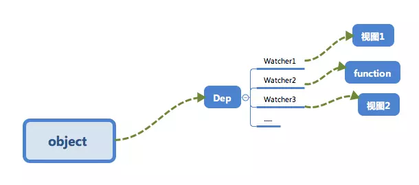

# 响应式系统的依赖收集追踪原理

## 为什么要依赖收集

举个例子，现在有这么一个 Vue 对象

```javascript
new Vue({
  template: `<div>
      <span>{{text1}}</span>
      <span>{{text2}}</span>
    </div>`,
  data: {
    text1: '文本1',
    text2: '文本2',
    text3: '文本3'
  }
})

// 修改 text3
this.text3 = '文本3-改'
```

修改了 `data` 中的 `text3` 的数据，但是因为视图中并不需要 `text3`，所以并不需要触发前面所写的 `updateView` 来更新视图，调用 `updateView` 显然是不正确的

再举一个例子

假设现在有一个全局对象数据，可能会在多个 Vue 实例中使用它进行展示

```javascript
const globalData = {
  text: '文本'
}

const vm1 = new Vue({
  template: `<div>
      <span>text</span>
    </div>`,
  data: globalData
})

const vm2 = new Vue({
  template: `<div>
      <span>text</span>
    </div>`,
  data: globalData
})

// 操作全局数据
globalData.text = '文本文本'
```

这里需要通知 `vm1` 和 `vm2` 两个 Vue 实例进行视图更新，**依赖收集** 会让 `text` 这个数据知道：有两个依赖 `text` 的数据，当 `text` 变化的时候需要通知这两个地方更新

最终会形成数据与视图的一种对应关系


