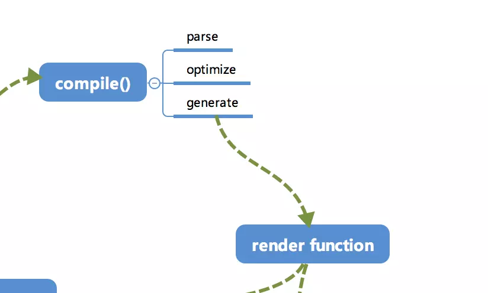

# 学习《剖析 Vue.js 内部运行机制》

::: tip 阅读 Vue 源码之前的准备工作
从总览的角度认识 Vue 的运行机制和相关原理，然后再去阅读 Vue 源码时可能会更容易的理解。带着问题学习：

1.  Vue.js 究竟是如何在我们对数据进行操作的时候影响视图的
2.  修改的数据如何批量高效地映射到视图上
3.  传统的 DOM 操作又在何时进行的

:::

## 目录

- [运行机制全局概览](#运行机制全局概览)
- [响应式系统的基本原理](#响应式系统的基本原理)
- [响应式系统的依赖收集追踪原理](#响应式系统的依赖收集追踪原理)
- [实现虚拟 DOM 下的一个 VNode 节点](#实现虚拟DOM下的一个VNode节点)
- [template 模版是怎样通过 Compile 编译的](#template模版是怎样通过Compile编译的)
- [批量异步更新策略及 nextTick 原理](#批量异步更新策略及nextTick原理)
- [Vuex 状态管理的工作原理](#Vuex状态管理的工作原理)
- [其他问题](#其他问题)

## 全局概览

Vue 内部流程图

## 初始化及挂载

在 `new Vue()` 之后，Vue 会调用 `_init` 函数进行初始化，会初始化生命周期、事件、props、methods、computed、watch 等。其中最重要的是通过 `Object.defineProperty`设置 `getter` 与 `setter` 函数，用来实现 **响应式** 以及 **依赖收集**

初始化之后调用 `$mount` 会挂载组件，如果是运行时编译，即不存在 `render function`但存在 `template` 的情况，需要进行 **编译** 步骤

## 编译

compile 编译可以分成 `parse`、`optimize` 与 `generate` 三个阶段，最终需要得到 `render function`

### parse

`parse` 会用正则等方式解析 `template`模版中的指令、class、style 等数据，形成 `AST`(即抽象语法树)
