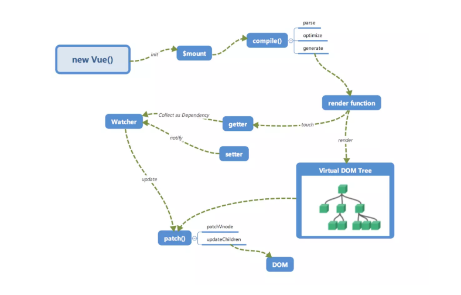
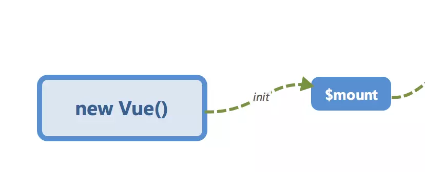
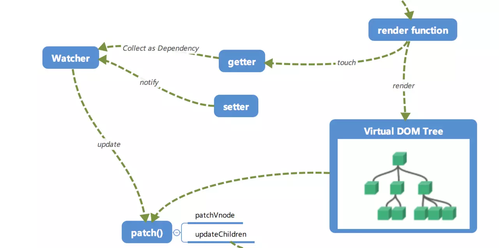
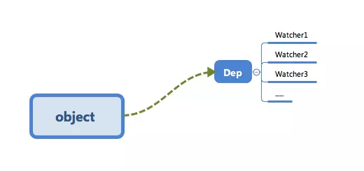
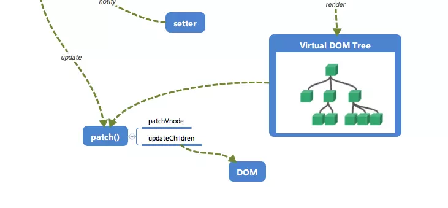

# 学习《剖析 Vue.js 内部运行机制》

::: tip 阅读 Vue 源码之前的准备工作
从总览的角度认识 Vue 的运行机制和相关原理，然后再去阅读 Vue 源码时可能会更容易的理解。带着问题学习：

1.  Vue.js 究竟是如何在我们对数据进行操作的时候影响视图的
2.  修改的数据如何批量高效地映射到视图上
3.  传统的 DOM 操作又在何时进行的

:::

## 目录

- [运行机制全局概览](#全局概览)
- [响应式系统的基本原理](/ECMAScript/Vue/02-响应式系统的基本原理.md)
- [响应式系统的依赖收集追踪原理](#响应式系统的依赖收集追踪原理)
- [实现虚拟 DOM 下的一个 VNode 节点](#实现虚拟DOM下的一个VNode节点)
- [template 模版是怎样通过 Compile 编译的](#template模版是怎样通过Compile编译的)
- [批量异步更新策略及 nextTick 原理](#批量异步更新策略及nextTick原理)
- [Vuex 状态管理的工作原理](#Vuex状态管理的工作原理)
- [其他问题](#其他问题)

## 全局概览

Vue 内部流程图



## 初始化及挂载



在 `new Vue()` 之后，Vue 会调用 `_init` 函数进行初始化，会初始化生命周期、事件、props、methods、computed、watch 等。其中最重要的是通过 `Object.defineProperty` 设置 `getter` 与 `setter` 函数，用来实现 **响应式** 以及 **依赖收集**

初始化之后调用 `$mount` 会挂载组件，如果是运行时编译，即不存在 render function 但存在 template 的情况，需要进行 **编译** 步骤

## 编译

compile 编译可以分成 `parse`、`optimize` 与 `generate` 三个阶段，最终需要得到 render function


### parse

`parse` 会用正则等方式解析 template 模版中的指令、class、style 等数据，形成 `AST`(即抽象语法树)

### optimize

`optimize` 的主要作用是标记 `static` 静态节点，这是 Vue 在编译过程中的一处优化，后面当 `update` 更新界面时，会有一个 `patch` 的过程，`diff` 算法会直接跳过静态节点，从而减少比较的过程，优化 `patch` 的性能

### generate

`generate` 是讲 `AST` (即抽象语法树)转化成 render function 字符串的过程，得到的结果是 render 的字符串以及 staticRenderFns 字符串

在经历 `parse`、`optimize` 与 `generate` 这三个阶段以后，组件中就会存在渲染 VNode 所需的 `render function` 了

## 响应式

`Vue.js` 响应式核心



在 `init` 的时候通过 `Object.defineProperty` 进行绑定 `getter` 和 `setter`，使得当被设置的对象被读取时候会执行 `getter` 函数，当被赋值的时候会执行 `setter` 函数

当 render function 被渲染的时候，因为会被读取所需的对象，所以会触发 `getter` 函数进行 **依赖收集**，**依赖收集**的目的是将观察者 Watcher 对象存放到当前闭包中的订阅者 Dep 的 subs 中，形成如下所示的一个关系：



在修改对象的时候，会触发 `setter`，`setter` 通知之前的 **依赖收集** 得到的 Dep 中的每一个 Watcher，告诉其值改变了，需要重新渲染视图。这时候这些 Watcher 就回开始调用 `update` 来更新视图，当然这中间还有一个 `patch` 以及使用队列来异步更新的策略

## Virtual DOM

render function 会被转化成 VNode 节点。Virtual DOM 其实就是一颗以 JavaScript 对象（VNode 节点）作为基础的树，用对象属性来描述节点，实际上只是一层对真是 DOM 的抽象，最终可以通过一系列操作使这棵树映射到真是环境上。由于 Virtual DOM 是以 JavaScript 对象为基础而不依赖真实平台环境，所以使他具有了跨平台的能力，比如说浏览器平台、Weex、Node 等，比如：

```javascript
{
  tag: 'div',
  children: [
    {
      tag: 'a',
      text: '链接'
    }
  ]
}
```

渲染后可以得到：

```html
<div>
  <a>链接</a>
</div>
```

这只是一个简单的列子，实际上的节点有更多的属性来标志节点，比如 isStatic（是否为静态节点），isComment（是否为注释节点）等

## 更新视图



前面有说到，在修改一个对象值的时候，会通过 `setter -> Watcher -> update` 的流程来修改对应的视图，那么最终是如何更新视图的？

当数据变化后，执行 render function 就可以得到一个新的 VNode 节点，如果想要得到新的视图，最简单粗暴的方式就是直接解析这个新的 VNode 节点，然后用 `innerHTML` 直接全部渲染到真实的 DOM 中。但是其实只是对其中一小块内容进行的修改，这样做似乎有些 **浪费**

那么为什么不能只修改 **改变了的地方** 呢？这个时候就要介绍 `patch` 了，将新的 VNode 与旧的 VNode 一起传入 `patch` 进行比较，经过 `diff` 算法得出它们的 **差异**，最后只需要将这些 **差异** 对应的 DOM 进行修改即可

## 总结


### 看完这篇文章有几个疑问？

1.  `parse` 解析形成的 `AST` 是什么结构，什么样的？
2.  render function 的字符串是怎么执行？ eval？
3.  依赖收集的时候，所有的 Watcher 对象放在一个大对象里面？观察者模式？
