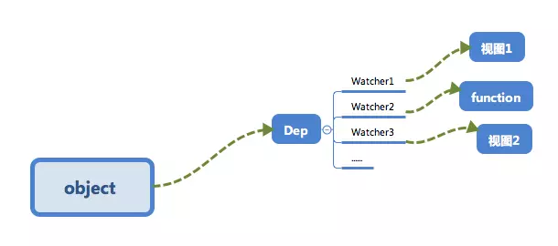
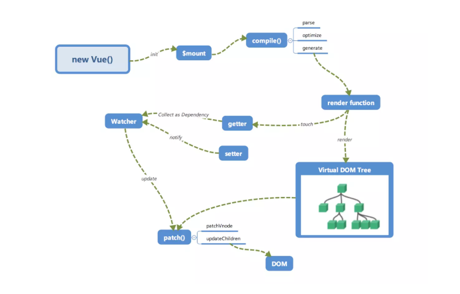

# 响应式系统的依赖收集追踪原理

## 为什么要依赖收集

举个例子，现在有这么一个 Vue 对象

```javascript
new Vue({
  template: `<div>
      <span>{{text1}}</span>
      <span>{{text2}}</span>
    </div>`,
  data: {
    text1: '文本1',
    text2: '文本2',
    text3: '文本3'
  }
})

// 修改 text3
this.text3 = '文本3-改'
```

修改了 `data` 中的 `text3` 的数据，但是因为视图中并不需要 `text3`，所以并不需要触发前面所写的 `updateView` 来更新视图，调用 `updateView` 显然是不正确的

再举一个例子

假设现在有一个全局对象数据，可能会在多个 Vue 实例中使用它进行展示

```javascript
const globalData = {
  text: '文本'
}

const vm1 = new Vue({
  template: `<div>
      <span>text</span>
    </div>`,
  data: globalData
})

const vm2 = new Vue({
  template: `<div>
      <span>text</span>
    </div>`,
  data: globalData
})

// 操作全局数据
globalData.text = '文本文本'
```

这里需要通知 `vm1` 和 `vm2` 两个 Vue 实例进行视图更新，**依赖收集** 会让 `text` 这个数据知道：有两个依赖 `text` 的数据，当 `text` 变化的时候需要通知这两个地方更新

最终会形成数据与视图的一种对应关系



接下来介绍一下 **依赖收集** 是如何实现的

## 订阅者 Dep

首先来实现一个订阅者 Dep，它主要的作用是用来存放 `Watcher` 观察者对象

```javascript
class Dep {
  constructor() {
    // 用来存放 Watcher 对象的数组
    this.subs = []
  }

  // 在 subs 中添加一个 Watcher 对象
  addSub(sub) {
    this.subs.push(sub)
  }

  notify() {
    this.subs.forEach(sub => {
      sub.update()
    })
  }
}
```

为了便于理解只实现了添加的部分代码，主要是两件事情：

1.  用 `addSub` 方法可以在目前的 `Dep` 对象中增加一个 `Watcher` 的订阅操作
1.  用 `notify` 方法通知 `Dep` 对象的 `subs` 中的所有 `Watcher` 对象触发更新操作

## 观察者 Watcher

```javascript
class Watcher {
  constructor() {
    // 在 new 一个 Watcher 对象时，将该对象赋值给 Dep.target，在 getter 中会用到
    Dep.target = this
  }

  update() {
    console.log('视图更新')
  }
}

Dep.target = null
```

## 依赖收集

接下来修改一下 `defineReactive` 以及 Vue 的构造函数，来完成依赖收集

在闭包中增加了一个 Dep 类的对象，用来收集 `Watcher` 对象。在对象被 **读** 的时候，会触发 `reactiveGetter` 函数把当前的 `Watcher` 对象（存放在 Dep.target 中）收集到 `Dep` 类的对象中。之后如果当该对象被 **写** 的时候，则会触发 `reactiveSetter` 方法，通知 `Dep`类的对象调用 `notify` 来触发所有 `Watcher` 对象的 `update` 方法更新对应的视图

```javascript
/**
 * 使数据变成响应式的
 * @param {*} obj
 * @param {*} key
 * @param {*} val
 */
function defineReactive(obj, key, val) {
  const dep = new Dep()

  Object.defineProperty(obj, key, {
    enumerable: true,
    configurable: true,
    get: function reactiveGetter() {
      // 这儿会进行依赖收集
      dep.addSub(Dep.target)

      return val
    },
    set: function reactiveSetter(newVal) {
      if (val === newVal) {
        return
      }

      // 根据依赖收集，修改数据时，触发视图更新
      dep.notify()
      // updateView(newVal)
    }
  })
}

function observer(obj) {
  if (!obj || typeof obj !== 'object') {
    return
  }

  Object.keys(obj).forEach(key => {
    // 此处的实现，实际上应该是一个递归操作
    defineReactive(obj, key, obj[key])
  })
}

class Vue {
  constructor(options) {
    this._data = options.data
    observer(this._data)

    // 新建一个 Watcher 观察者对象，这时候 Dep.target 会指向这个 Watcher 对象
    new Watcher()

    //
    console.log('rener', this._data.message)
  }
}

let vm = new Vue({
  data: {
    message: 'mvvm'
  }
})

vm._data.message = 'Vue'
```

## 小结

首先在 `observer` 的过程中会注册 `get` 方法，该方法用来进行 **依赖收集**。在它的闭包中会有一个 `Dep` 类的对象，这个对象用来存放 `Watcher` 类的实例。其实 **依赖收集** 的过程就是把 `Watcher`类的实例存放到对应的 `Dep` 类的对象中去。`get` 方法可以让当前的 `Watcher` 类的对象（Dep.target）存放到它的 subs 中。在数据变化时，`set` 会调用 `Dep` 对象的 `notify` 方法通知它内部所有的 `Watcher`类的对象进行视图更新。

这是 `Object.defineProperty` 的 `set/get` 方法处理的事情，那么 **依赖收集** 的前提条件还有两个：

1.  触发 `get` 方法
1.  新建一个 `Watcher` 对象

这个我们在 Vue 的构造类中处理。新建一个 `Watcher` 对象只需要 new 出来，这时候 `Dep.target` 已经指向了这个 new 出来的 `Watcher` 对象来。而触发 `get` 方法也很简单，实际上只要把 render function 进行渲染，那么其中的依赖的对象都会被 **读取**，这里我们通过打印来模拟这个过程，读取 message 来触发 `get` 进行 `依赖收集`

其主要就是 get 进行「依赖收集」。set 通过观察者来更新视图，配合下图仔细捋一捋：



## [源代码](https://jsfiddle.net/zuoyi615/q5oum21j/)
