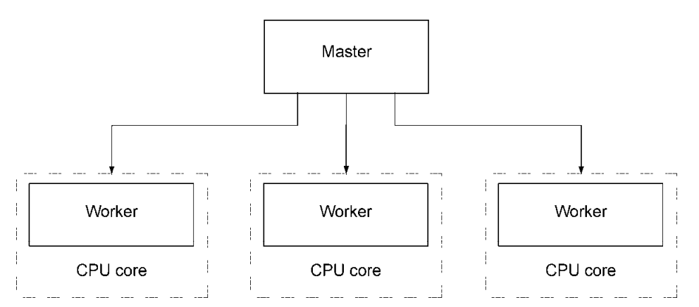

# Node 集群

现代的计算机 CPU 大多数都是多核的，但单个 Node 进程在运行时只能使用其中的一个内核。如果想 Node 程序最大限度地利用服务器，有两种方式可以实现

- 在不同的 TCP/IP 端口上启动多个程序实例，并通过负载均衡把 web 流量分发到不同的实例上，但这种方式设置起来费劲
- 为了让单个程序使用多核实现起来更容易，Node 增加了集群（cluster）API。借助这个 API，程序可以在不同的程序不同的内核上同时运行多个 worker，每个 worker 做的都是相同的事情，并且是在同一个 TCP/IP 端口上返回响应



#### Node 集群 API 演示

```javascript
const cluster = require('cluster')
const http = require('http')
const numCPUs = require('os').cpus().length

// 判断是否为主进程
if (cluster.isMaster) {
  for (let i = 0; i < numCPUs; i++) {
    cluster.fork()
  }
  cluster.on('exit', function(worker, code, signal) {
    console.log(`Worker ${worker.process.pid} died.`)
  })
} else {
  http
    .createServer(function(req, res) {
      res.writeHead(200)
      res.end(`I am a worker running in process ${process.pid}`)
    })
    .listen(3000)
}
```

#### 集群子进程通信

```javascript
const cluster = require('cluster')
const http = require('http')
const numCPUs = require('os').cpus().length
const workers = {}
let requests = 0

if (cluster.isMaster) {
  for (let i = 0; i < numCPUs; i++) {
    workers[i] = cluster.fork()
    ;(function(i) {
      workers[i].on('message', function(message) {
        if (message.cmd == 'incrementRequestTotal') {
          requests++
          for (let j = 0; j < numCPUs; j++) {
            workers[j].send({
              cmd: 'updateOfRequestTotal',
              requests: requests
            })
          }
        }
      })
    })(i)
  }

  cluster.on('exit', function(worker, code, signal) {
    console.log('Worker ' + worker.process.pid + ' died.')
  })
} else {
  process.on('message', function(message) {
    if (message.cmd == 'updateOfRequestTotal') {
      requests = message.requests
    }
  })

  http
    .Server(function(req, res) {
      res.writeHead(200)
      res.end(
        'Worker in process ' +
          process.pid +
          ' says cluster has responded to ' +
          requests +
          ' requests.'
      )
      process.send({ cmd: 'incrementRequestTotal' })
    })
    .listen(8000)
}
```
