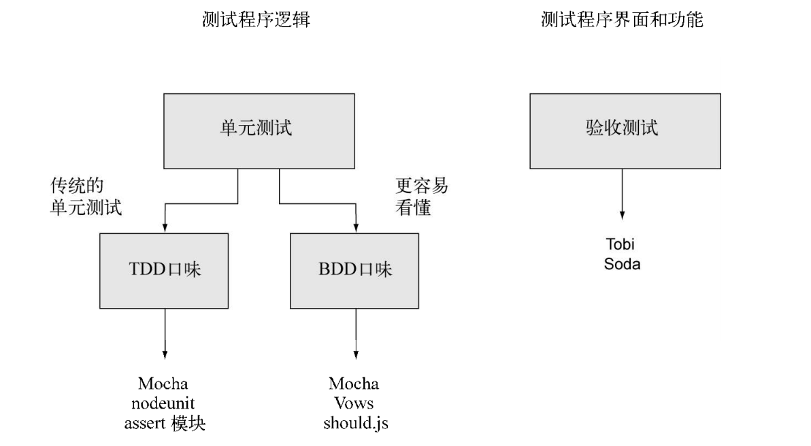

# 测试 Node 程序

两种自动化测试：单元测试和验收测试

单元测试直接测试代码逻辑，通常实在函数或方法层面，适用于所有类型的程序。单元测试方法可以分为两大形态：测试驱动开发（TDD）和行为驱动开发（BDD）

验收测试是额外的测试层，在 Web 程序上用得很普遍。验收测试用脚本控制浏览器，并试图用它触发 Web 程序的功能



## 单元测试

### assert 模块

Node 内置的 assert 模块，TDD 风格自动化测试的好工具

#### 示例

```javascript
// Todo.js
class Todo {
  constructor() {
    this.todos = []
  }

  add(item) {
    if (!item) throw new Error('Todo#add requires an item')
    this.todos.push(item)
  }

  deleteAll() {
    this.todos = []
  }

  getCount() {
    return this.todos.length
  }

  doAsync(cb) {
    setTimeout(cb, 2000, true)
  }
}

module.exports = Todo

// todo_test.js
const assert = require('assert')
const Todo = require('./Todo')

const todo = new Todo()
let testCompleted = 0

// assert.equal()
function deleteAllTest() {
  // 添加一些数据以便测试断言
  todo.add('item')

  // 断言数据被正确添加
  assert.equal(todo.getCount(), 1, '1 item should exist')

  // 删除所有记录
  todo.deleteAll()

  // 断言记录已被删除
  assert.equal(todo.getCount(), 0, 'No items should exist')

  // 记录测试已经完成
  testCompleted++
}

// assert.notEqual()
function addTest() {
  // 删除之前的所有项
  todo.deleteAll()

  // 添加事项
  todo.add('item')

  // 断言程序应该存在的结果
  assert.notEqual(todo.getCount(), 0, '1 item should exist')

  testCompleted++
}

function doAsyncTest(cb) {
  // 两秒后激活回调函数
  todo.doAsync(function(value) {
    // 断言值为 true
    assert.ok(value, 'Callback should be passed true')

    testCompleted++

    // 完成后激活或吊函数
    cb()
  })
}

function throwsTest(cb) {
  // 不带参数调用 todo.add
  assert.throws(todo.add, /requires/)

  // 记录测试已完成
  testCompleted++
}

// 运行测试并报告测试完成
deleteAllTest()
addTest()
throwsTest()
doAsyncTest(function() {
  console.log(`Completed ${testCompleted} tests`)
})
```

assert 模块的其他方法：

- strictEqual：使用严格相等来做断言 ===
- notStrictEqual: 使用严格相等来做断言 ===
- deepEqual：递归对象，比较属性
- notDeepEqual：不递归

使用 Node 的内置功能，每个测试都要包含很多套路化的代码测试测试（比如删除所有事项，追踪测试进程），一些测试框架，会来做这些套路化的工作，让测试更专注于业务逻辑测试

### Nodeunit

#### 安装

```bash
npm i -g nodeunit
```

#### 示例

```javascript
// nodeunit_test.js
function testPony(test) {
  const isPony = true
  test.ok(isPony, 'This is not a Pony.')
  test.done()
}

function testPony2(test) {
  let count = 0
  const isPony = true
  if (!isPony) {
    test.ok(isPony, 'This should not hava passed.')
    count++
  }

  test.ok(isPony, 'This should hava passed.')
  count++

  test.strictEqual(count, 2, 'Not all assertions triggerd')
  test.done()
}

module.exports = {
  testPony,
  testPony2
}

// nodeunit nodeunit_test.js
```

### mocha

mocha 是 BDD 风格的，但也可以把它用在 TDD 风格的测试中

#### 安装

```bash
npm i -g mocha
```

#### 示例

```javascript
// index.js
let db = []

function save(doc) {
  db.push(doc)
}

function first(obj) {
  return db
    .filter(doc => {
      for (const key in obj) {
        if (obj[key] !== doc[key]) {
          return false
        }
      }
      return true
    })
    .shift()
}

function clear() {
  db = []
}

function savaAsync(doc, cb) {
  db.push(doc)

  if (cb) {
    setTimeout(function() {
      cb()
    }, 1000)
  }
}

module.exports = {
  save,
  first,
  clear,
  savaAsync
}

// test/memdb.js
const assert = require('assert')
const memdb = require('..')

describe('memdb', function() {
  beforeEach('memdb', function() {
    memdb.clear()
  })

  describe('#save(doc)', function() {
    it('should have the document', function() {
      const pet = { name: 'Tobi' }
      memdb.save(pet)
      const ret = memdb.first({ name: 'Tobi' })
      assert(ret == pet)
    })
  })

  describe('#first(obj)', function() {
    it('should return the first matching doc', function() {
      const tobi = { name: 'Tobi' }
      const loki = { name: 'Loki' }
      memdb.save(tobi)
      memdb.save(loki)

      const ret1 = memdb.first({ name: 'Tobi' })
      assert(ret1 == tobi)
      const ret2 = memdb.first({ name: 'Loki' })
      assert(ret2 == loki)
    })

    it('should return null when no doc matches', function() {
      const ret = memdb.first({ name: 'Gim' })
      assert(ret == null)
    })
  })

  describe('#savaAsync(doc)', function() {
    it('should have the document', function(done) {
      const pet = { name: 'Peter' }
      memdb.savaAsync(pet, function() {
        const ret = memdb.first({ name: 'Peter' })
        assert(ret == pet)

        // 告诉异步测试完成
        done()
      })
    })
  })
})

// mocha
```

## 验收测试

验收测试也被称为功能测试，它测试程序的输出而不是逻辑。不做过多深入了解
